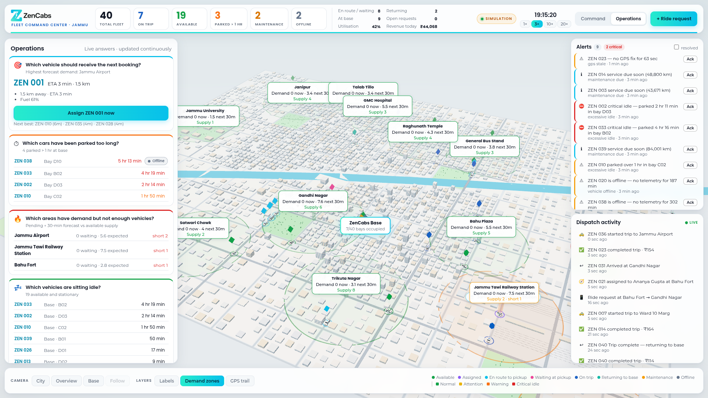
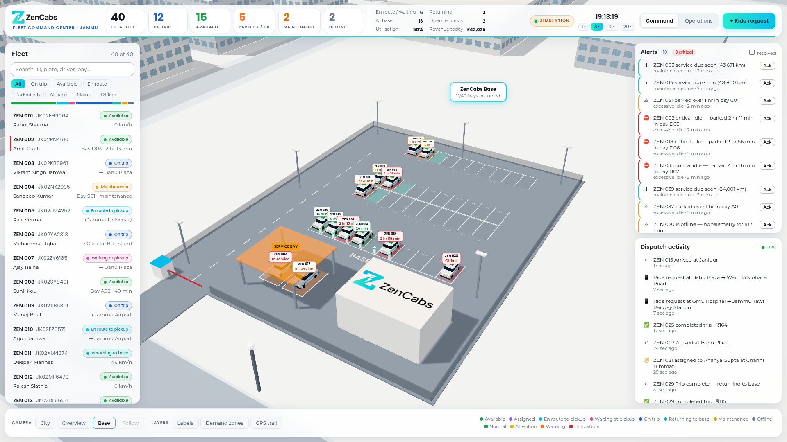
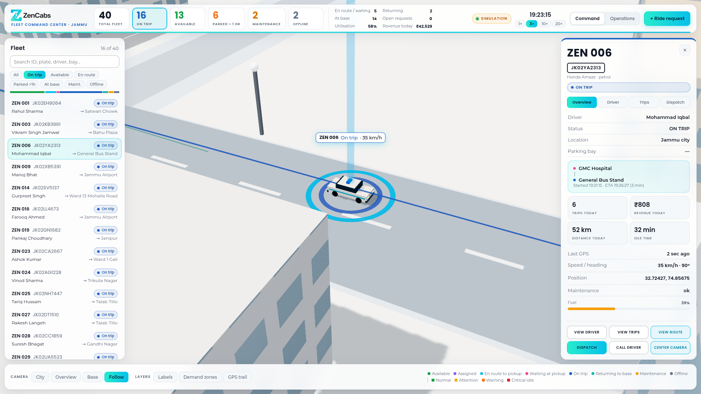
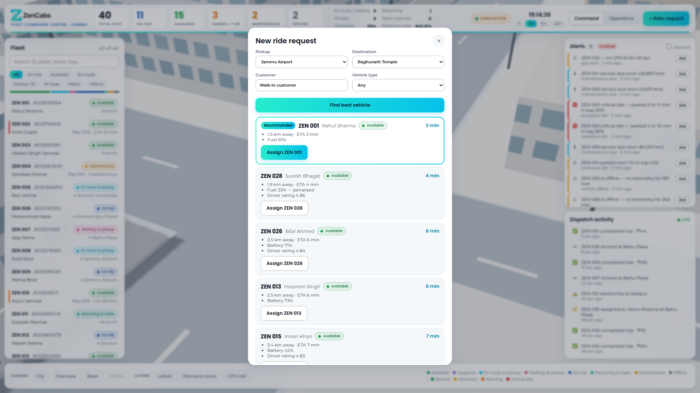

# ZenCabs Fleet Command Center (prototype)

A 3D, real-time fleet operations console for the 40-vehicle ZenCabs fleet in Jammu.

This version runs entirely on **simulated data**:

- live GPS movement
- dispatching, driver assignments and trips
- parking timers
- alerts and metrics

It is built so the simulation can be swapped for the real ZenCabs APIs without rebuilding the frontend.

```bash
npm install
npm run dev            # http://localhost:5173  (DATA_MODE = MOCK, in-browser simulation)
```

Useful URL flags:

| Flag | Effect |
| --- | --- |
| `?speed=10` | Starting simulation speed. Can also be changed in the top bar: 1×/3×/10×/20×. |
| `?mode=LIVE` | Use the backend instead of the in-browser simulation. |



| Base parking twin | Vehicle follow + route | Dispatch console |
| --- | --- | --- |
|  |  |  |

### Try LIVE mode (same UI, real HTTP + WebSocket)

```bash
npm run server         # placeholder backend on :8787 serving the REST + WS contracts
npm run dev:live       # or open http://localhost:5173/?mode=LIVE
```

## What's in the prototype

**3D city and digital twin**
- A daylight Jammu-like city: arterial roads, the Tawi river with bridges, the airport, the railway station and landmarks.
- The ZenCabs base lot with **40 bays (A01–D10)**, 2 service bays and EV chargers.
- Cars physically occupy bays. A bay shows as empty when its car leaves, and returning cars drive in through the gate and aisles into a free bay.

**Live movement**
- Vehicles follow GPS fixes interpolated smoothly between updates.
- Cars keep to the left lane, stop at signals and slow for turns.

**Parking timer**
- Each bay shows "Parked for 1 hr 42 min" when the camera is close.
- Bay colours mark idle time: 0–30 min normal, 30–60 attention, 60–120 warning, 120+ critical (pulsing).

**Vehicle interaction**
- Clicking a car (or a row in the fleet list) flies the camera to it, highlights it, follows it and opens the detail panel.
- The panel shows driver, status, location, bay, parked time, trips, revenue, distance, idle time, last GPS and energy.
- Actions: **View driver · View trips · View route · Dispatch · Call driver · Center camera**.

**Fleet HUD**
- TOTAL FLEET, ON TRIP, AVAILABLE, PARKED > 1 HR, MAINTENANCE and OFFLINE, plus en route, returning, utilisation and revenue.
- Clicking a KPI filters both the list and the 3D view.

**Dispatch**
- **+ Ride request** opens the dispatch console.
- It recommends the best vehicle with ETA and reasons. Assigning one lets you watch it go ASSIGNED → EN_ROUTE_PICKUP → WAITING → ON_TRIP → AVAILABLE / RETURNING_TO_BASE.

**Operations view** (press `o`) answers:
- Which vehicles are sitting idle?
- Which drivers are working?
- Which cars have been parked too long?
- Which vehicles are top earners?
- Where are the cars concentrated?
- Where is demand short of vehicles? (3D demand zones)
- Which vehicle should get the next booking?
- Which cars have low revenue?
- Which vehicles have stale GPS?

**Alerts and activity**
- Live alert feed: excessive idle, GPS stale, overspeed, low battery/fuel, long wait at pickup, unserved demand, offline, maintenance due.
- Critical alerts also pop up as toasts.
- A dispatch activity feed shows events as they happen.

Keyboard: `Esc` deselect · `o` Operations · `b` base camera · `c` city camera.

## Brand

The interface follows the ZenCabs Brand Guidelines:

- **Colours:** primary #07C0EB and #27EBCD, and the #27EBCD → #07C0EB gradient for primary actions and highlights. White and #BDBDBD for surfaces and borders.
- **Fonts:** Poppins for headings and numbers, Montserrat for body text. Both are bundled locally, so the console also works offline.
- **Logo:** the official ZenCabs logo (`public/brand/`) appears in the top bar, the favicon, the loading screen and on the base office roof in 3D.

All colours are defined in one file, `src/config/theme.ts`, which feeds both the UI and the 3D scene.

## Architecture

The UI and 3D scene consume **services** only: `vehicleService`, `driverService`, `gpsService`, `bookingService`, `dispatchService`, `parkingService`, `analyticsService`, `alertService` (plus `mapService`).

Services talk to an `ApiClient`, a `RealtimeClient` and a `GPSProvider`. `DATA_MODE` decides which implementation is plugged in:

| | MOCK (prototype) | LIVE |
| --- | --- | --- |
| REST | `MockApiClient` → in-browser router | `HttpApiClient` |
| Realtime | `MockRealtimeClient` | `WebSocketRealtimeClient` |
| GPS | `MockGPSProvider` | `ZenCabsGPSProvider` |
| Clock | `SimClock` (accelerable) | `WallClock` (server-synced) |

Further reading:

- [docs/ARCHITECTURE.md](docs/ARCHITECTURE.md): layers, design decisions and the going-live checklist
- [docs/API_CONTRACTS.md](docs/API_CONTRACTS.md): REST endpoints, WebSocket events and dispatch scoring
- [docs/DATABASE.md](docs/DATABASE.md) and [db/schema.sql](db/schema.sql): PostgreSQL schema covering vehicles, drivers, vehicle_locations, trips, bookings, parking_sessions, driver_shifts, vehicle_status_history, maintenance_records, alerts and fleet_events

Configuration lives in `src/config/dataConfig.ts` and `.env` (see `.env.example`).

## Scripts

| Script | |
| --- | --- |
| `npm run dev` | Dev server (MOCK) |
| `npm run dev:live` | Dev server in LIVE mode |
| `npm run server` | Placeholder backend (REST + WebSocket) on :8787 |
| `npm run build` | Typecheck + production build |
| `npm test` | Simulation, contract and service tests (Vitest) |

## Tech

React 19, three.js via @react-three/fiber and drei, postprocessing (bloom), zustand, Vite and TypeScript.

There are no external 3D assets or map tiles: the city, cars and lot are generated procedurally.
