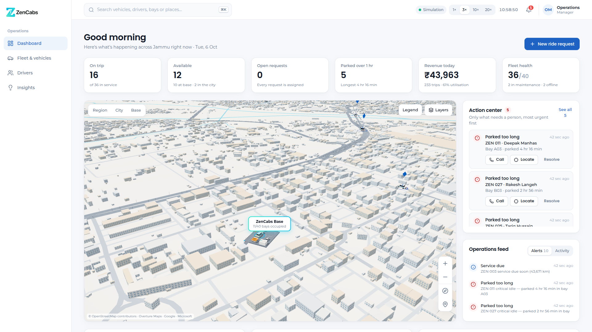
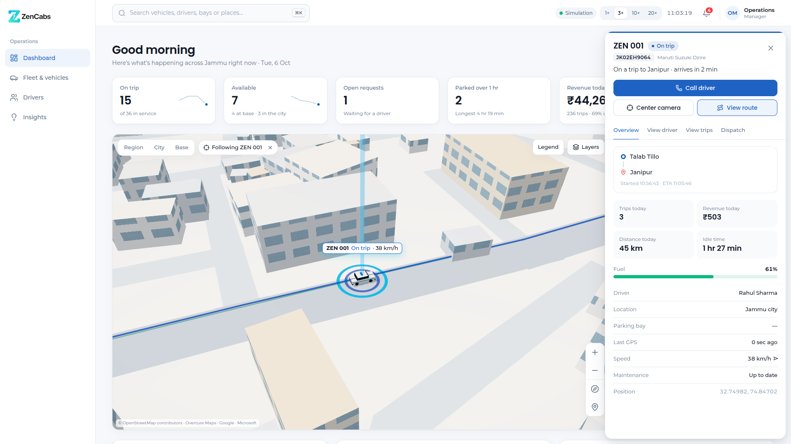
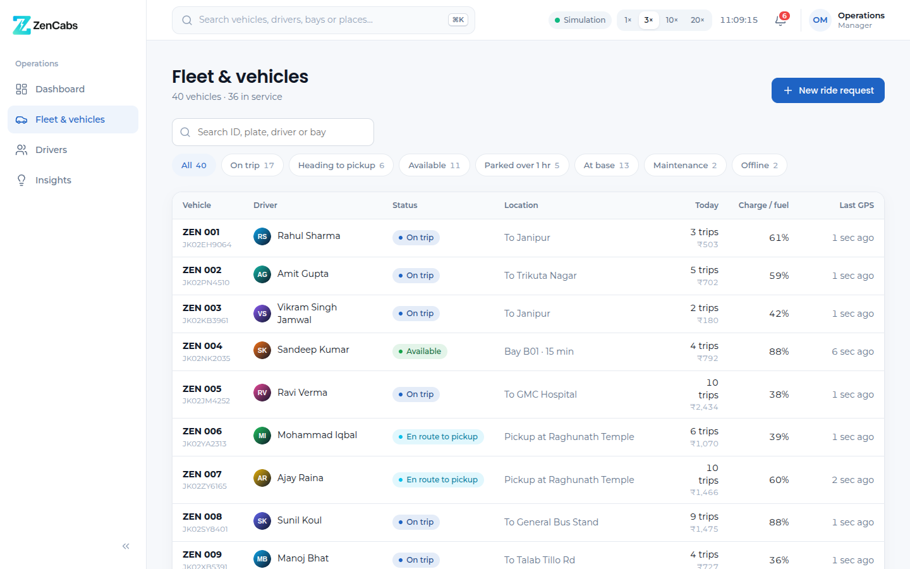
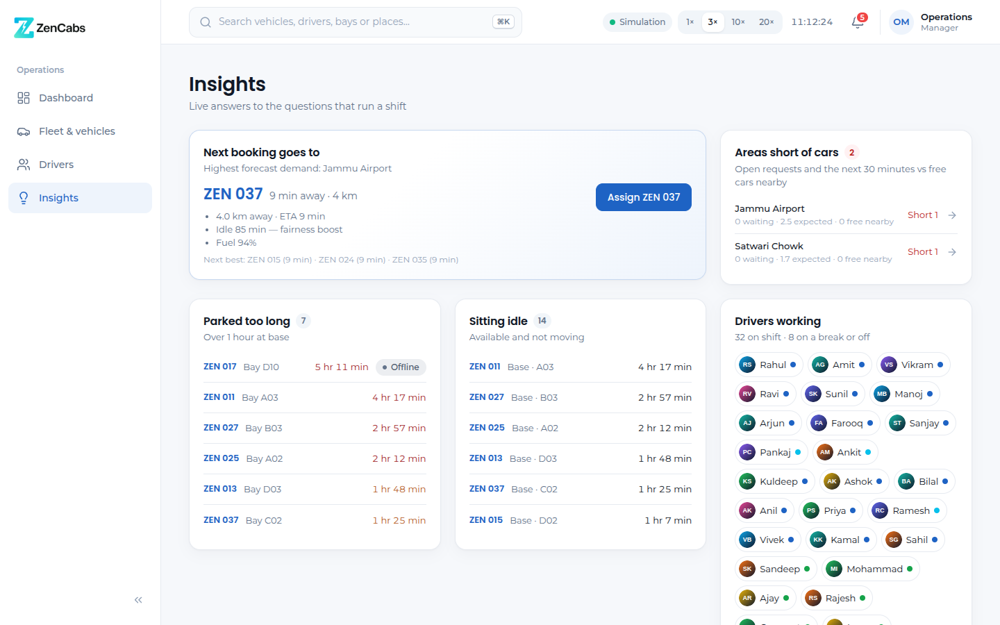
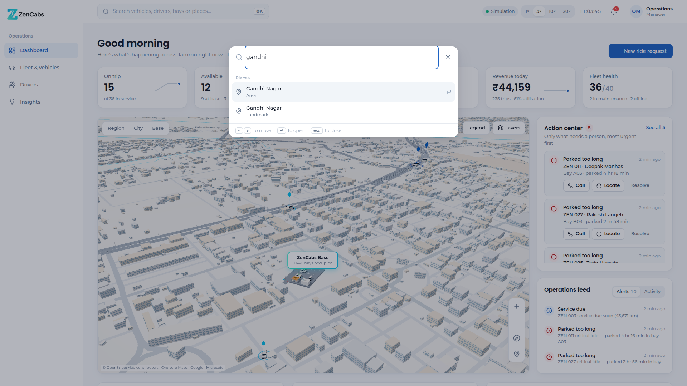
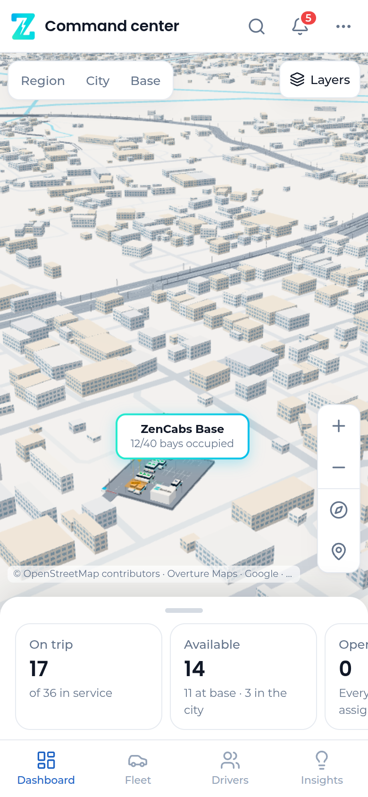
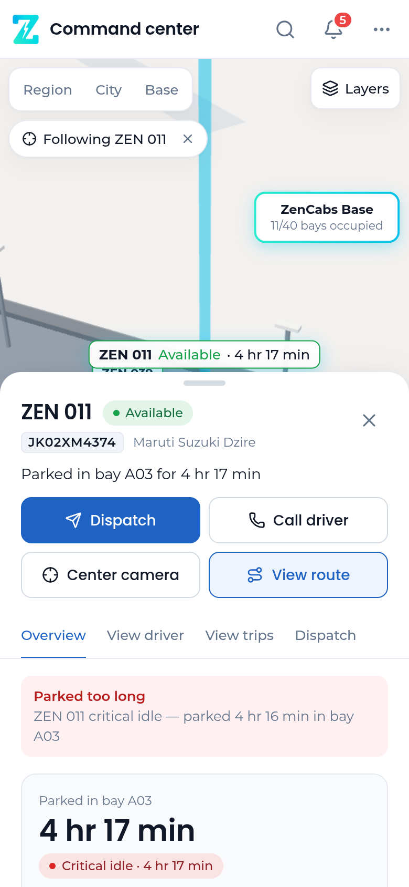
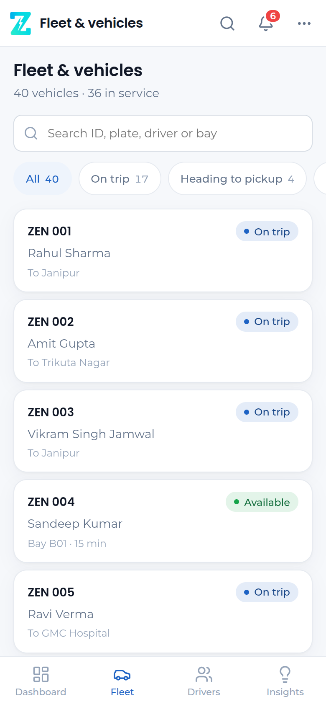

# ZenCabs Fleet Command Center (prototype)

A 3D, real-time fleet operations console for the 40-vehicle ZenCabs fleet in Jammu.

This version runs entirely on **simulated data**:

- live GPS movement
- dispatching, driver assignments and trips
- parking timers
- alerts and metrics

It is built so the simulation can be swapped for the real ZenCabs APIs without rebuilding the frontend.

```bash
npm install
npm run dev            # http://localhost:5173  (DATA_MODE = MOCK, in-browser simulation)
```

Useful URL flags:

| Flag | Effect |
| --- | --- |
| `?speed=10` | Starting simulation speed. Can also be changed in the header (1×/3×/10×/20×), or under ⋯ on phones. |
| `?mode=LIVE` | Use the backend instead of the in-browser simulation. |



| Vehicle drawer (following a car on its route) | New ride request |
| --- | --- |
|  |  |

| Fleet & vehicles | Insights | Search (⌘K) |
| --- | --- | --- |
|  |  |  |

| Phone: dashboard | Phone: vehicle sheet | Phone: fleet |
| --- | --- | --- |
|  |  |  |

### Try LIVE mode (same UI, real HTTP + WebSocket)

```bash
npm run server         # placeholder backend on :8787 serving the REST + WS contracts
npm run dev:live       # or open http://localhost:5173/?mode=LIVE
```

## What's in the prototype

**3D city and digital twin**
- The **real map of Jammu** and neighbouring towns (Nagrota, Akhnoor, R.S. Pura, Bari Brahmana, Vijaypur): real streets with their names, the Tawi river and its bridges, the Ranbir Canal, parks, rail lines and about 150,000 real building footprints. Simulated cars drive on the actual road network.
- The ZenCabs base lot with **40 bays (A01–D10)**, 2 service bays and EV chargers.
- Cars physically occupy bays. A bay shows as empty when its car leaves, and returning cars drive in through the gate and aisles into a free bay.

**Live movement**
- Vehicles follow GPS fixes interpolated smoothly between updates.
- Cars keep to the left lane, stop at signals and slow for turns.

**Parking timer**
- Each bay shows "Parked for 1 hr 42 min" when the camera is close.
- Bay colours mark idle time: 0–30 min normal, 30–60 attention, 60–120 warning, 120+ critical (pulsing).

**Vehicle interaction**
- Clicking a car on the map (or anywhere it is listed) opens the **vehicle drawer**. On the map it also flies the camera to the car, highlights it and follows it. Panning the map stops following.
- The drawer opens with a one-line summary ("On a trip to Janipur · arrives in 2 min"), then shows driver, status, location, bay, parked time, trips, revenue, distance, idle time, last GPS and energy.
- Actions: **View driver · View trips · View route · Dispatch · Call driver · Center camera**.

**Dashboard**
- Six KPI cards: on trip, available, open requests, parked over 1 hr, revenue today and fleet health. Each one shows context and its 30-minute trend. Clicking a card filters the map; fleet health opens the fleet list.
- The live map takes most of the page. Next to it are the **Action center** (only items that need a person, most urgent first, each with Call / Locate / Resolve) and the **Operations feed** (alerts and dispatch activity).
- Below the map, a trends row shows rides per hour, cumulative revenue and fleet utilisation. Every chart can be switched to a table.
- Other pages: **Fleet & vehicles** (searchable, filterable table), **Drivers**, and **Insights**.
- **Search (⌘K / Ctrl-K or `/`)** finds any vehicle, plate, driver, bay, area or landmark and jumps to it.

**Dispatch**
- **New ride request** opens the dispatch dialog.
- It recommends the best vehicle with ETA and reasons. Assigning one lets you watch it go ASSIGNED → EN_ROUTE_PICKUP → WAITING → ON_TRIP → AVAILABLE / RETURNING_TO_BASE.

**Insights** answers:
- Which vehicles are sitting idle?
- Which drivers are working?
- Which cars have been parked too long?
- Which vehicles are top earners?
- Where are the cars concentrated?
- Where is demand short of vehicles? (3D demand zones)
- Which vehicle should get the next booking?
- Which cars have low revenue?
- Which vehicles have stale GPS?

**Alerts and activity**
- Live alert feed: excessive idle, GPS stale, overspeed, low battery/fuel, long wait at pickup, unserved demand, offline, maintenance due.
- Critical alerts also pop up as toasts.
- A dispatch activity feed shows events as they happen.

**Map controls**
- Drag pans along the ground, like a map.
- Scroll, pinch or double-click zooms towards the point under the cursor.
- Right-drag (or two fingers) rotates and tilts. The tilt flattens automatically as you zoom out, so the region view never skims the horizon.
- The on-map buttons zoom in/out, face north and jump to the base. Region / City / Base switch between preset views.

**Phones (under 768 px)** get only the essentials:
- A full-screen map with a bottom nav (Dashboard / Fleet / Drivers / Insights).
- A drag-up sheet holding the KPIs, the new-ride button, the Action center and the feed.
- The vehicle drawer opens as a bottom sheet.
- Every touch target is at least 44 px.
- Shadows, post-processing and the smallest buildings are switched off to keep the frame rate up.

Keyboard: `⌘K` / `/` search · `Esc` close or deselect · `+` / `−` zoom · `n` face north · `b` base · `c` city · `r` region.

## Brand

The interface follows the ZenCabs Brand Guidelines:

- **Colours:** the brand sky #07C0EB and aqua #27EBCD (and their gradient) for map highlights and the base. The logo's tagline blue #1E63C4 is used for primary actions and active navigation, because it keeps white text readable. Surfaces are white on a neutral #F6F8FB, with hairline borders.
- **Layout:** follows the dashboard principles in the design brief: calm neutral surfaces, sentence-case labels, 4–6 KPIs with context and trend, a dominant map, an action center, and progressive disclosure (the drawer and dialogs hold the detail). There is one icon family ([Lucide](https://lucide.dev)).
- **Fonts:** Poppins for headings and numbers, Montserrat for body text. Both are bundled locally, so the console also works offline.
- **Logo:** the official ZenCabs logo (`public/brand/`) appears in the sidebar, the favicon, the loading screen and on the base office roof in 3D.

Scene colours are defined in `src/config/theme.ts`. The UI tokens (colour, radius, spacing, breakpoints) live in `src/styles.base.css`.

## Architecture

The UI and 3D scene consume **services** only: `vehicleService`, `driverService`, `gpsService`, `bookingService`, `dispatchService`, `parkingService`, `analyticsService`, `alertService` (plus `mapService`).

Services talk to an `ApiClient`, a `RealtimeClient` and a `GPSProvider`. `DATA_MODE` decides which implementation is plugged in:

| | MOCK (prototype) | LIVE |
| --- | --- | --- |
| REST | `MockApiClient` → in-browser router | `HttpApiClient` |
| Realtime | `MockRealtimeClient` | `WebSocketRealtimeClient` |
| GPS | `MockGPSProvider` | `ZenCabsGPSProvider` |
| Clock | `SimClock` (accelerable) | `WallClock` (server-synced) |

Further reading:

- [docs/ARCHITECTURE.md](docs/ARCHITECTURE.md): layers, design decisions and the going-live checklist
- [docs/API_CONTRACTS.md](docs/API_CONTRACTS.md): REST endpoints, WebSocket events and dispatch scoring
- [docs/DATABASE.md](docs/DATABASE.md) and [db/schema.sql](db/schema.sql): PostgreSQL schema covering vehicles, drivers, vehicle_locations, trips, bookings, parking_sessions, driver_shifts, vehicle_status_history, maintenance_records, alerts and fleet_events

Configuration lives in `src/config/dataConfig.ts` and `.env` (see `.env.example`).

## Scripts

| Script | |
| --- | --- |
| `npm run dev` | Dev server (MOCK) |
| `npm run dev:live` | Dev server in LIVE mode |
| `npm run server` | Placeholder backend (REST + WebSocket) on :8787 |
| `npm run build` | Typecheck + production build |
| `npm test` | Simulation, contract and service tests (Vitest) |

## Tech

React 19, three.js via @react-three/fiber and drei (camera-controls), postprocessing (bloom), zustand, lucide-react, Vite and TypeScript.

There are no paid services or map tiles: the city is built from free open data at build time (see below), and the cars and parking lot are generated procedurally.

## Real map data

The map comes from [Overture Maps](https://overturemaps.org), which packages OpenStreetMap roads with Google Open Buildings and Microsoft building footprints. It's free and needs no API key. Two files are committed and served as static assets:

| File | Contents |
| --- | --- |
| `public/maps/jammu-map.json` (2.8 MB) | Road graph with geometry and names, water, parks, rail, airport taxiways, landmarks |
| `public/maps/jammu-buildings.bin` (1.8 MB) | Building footprints as oriented boxes (heights estimated: the source data has none) |

To refresh the data or change the area:

```bash
pip install overturemaps
scripts/fetch_jammu_map.sh raw            # downloads the raw layers (~150 MB)
python3 scripts/build_jammu_map.py raw    # rewrites the two files above
```

- **Area:** edit the bounding boxes at the top of both scripts. Landmarks and their demand weights are in `LANDMARKS` in `build_jammu_map.py`.
- **Base lot location:** set `BASE_ANCHOR` in `src/mock/world/jammuMap.ts` to your real depot. The lot is placed on the nearest street with room for it, and buildings under it are cleared.
- **Credit (required by the licences):** the app shows "Map data © OpenStreetMap contributors · Overture Maps Foundation · Google Open Buildings · Microsoft Building Footprints" on screen.
