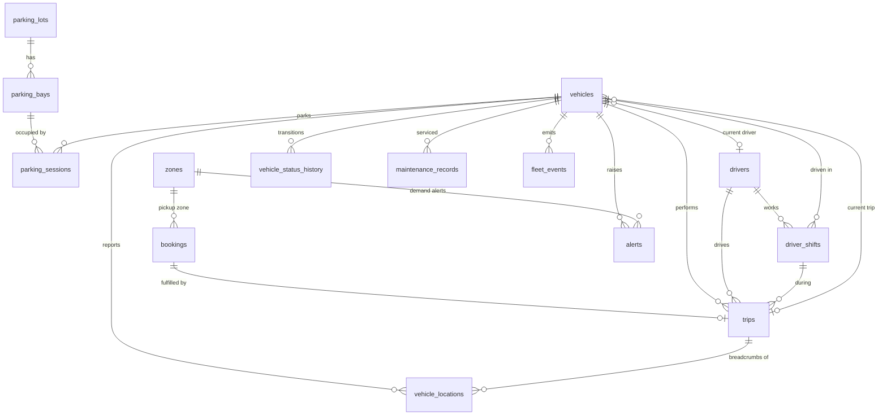

# Database design

The full DDL is in [`db/schema.sql`](../db/schema.sql). It was validated against PostgreSQL 16. PostGIS is optional: when it's installed, the schema adds spatial columns and indexes automatically.

| Table | Purpose | Feeds |
| --- | --- | --- |
| `vehicles` | Master data plus denormalised current state (status, last position, energy) | `GET /api/vehicles`, HUD |
| `drivers` | Driver master data | `GET /api/drivers` |
| `driver_shifts` | Shift and break periods; at most one open shift per driver | "Which drivers are working?" |
| `vehicle_locations` | Raw GPS fixes. High volume: partition monthly or use TimescaleDB. | GPS trail, replay, distance |
| `bookings` | Ride requests from the app, call centre, walk-ins or corporate clients | Demand vs supply, unserved alerts |
| `trips` | Booking fulfilment. One active trip per vehicle (partial unique index). | Trips, revenue |
| `parking_lots` / `parking_bays` | Digital twin geometry (replaceable layout) | `GET /api/parking/layout` |
| `parking_sessions` | Entry and exit per bay. One open session per vehicle and per bay. | Parking timers |
| `vehicle_status_history` | Audit of every status transition | Idle-time and utilisation analytics |
| `maintenance_records` | Service history and next due date | Maintenance alerts |
| `alerts` | Operational alerts, de-duplicated by `dedupe_key` while open | Alert feed |
| `fleet_events` | Append-only log of every realtime event | WebSocket replay, audit |
| `zones` | Demand areas (airport, railway station, …) | Concentration, demand gaps |

## Derived values

These are computed rather than stored:

| Value | Derivation |
| --- | --- |
| `parkingDuration` | `now() - parking_sessions.entry_time` for the open session (`v_parking_state`) |
| `tripsToday` / `revenueToday` / `distanceToday` | Aggregated from `trips` in the IST day (`v_vehicle_today`) |
| `idleTimeToday` | Sum of `AVAILABLE` + stationary periods from `vehicle_status_history` and `vehicle_locations` |
| GPS stale | `now() - vehicles.last_gps_at > 60 s` |
